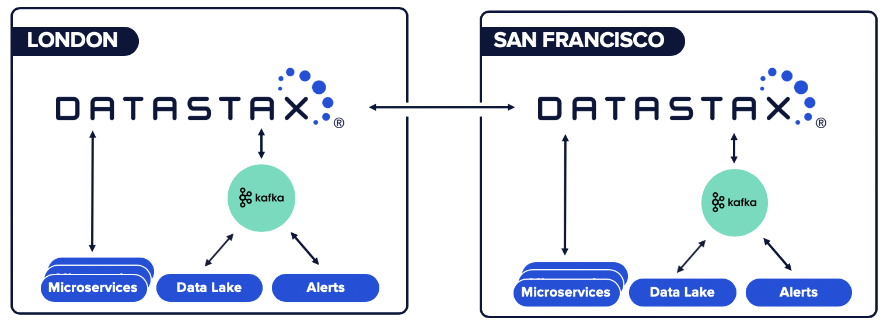
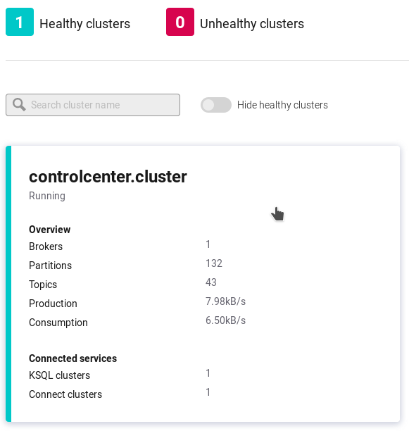
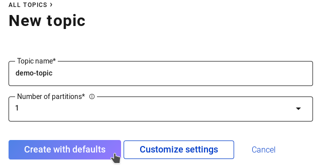
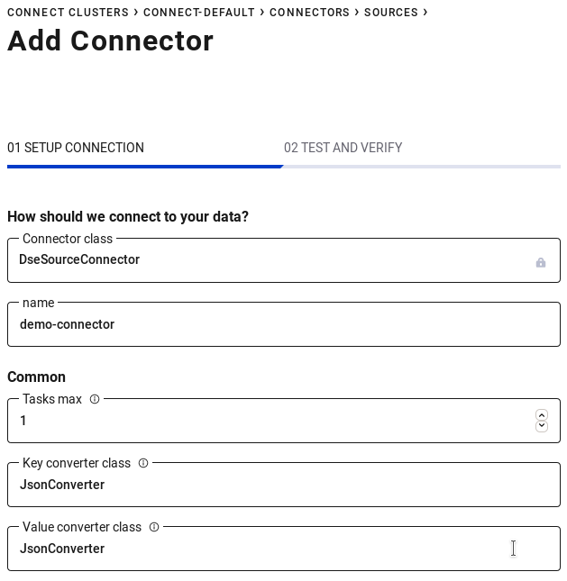
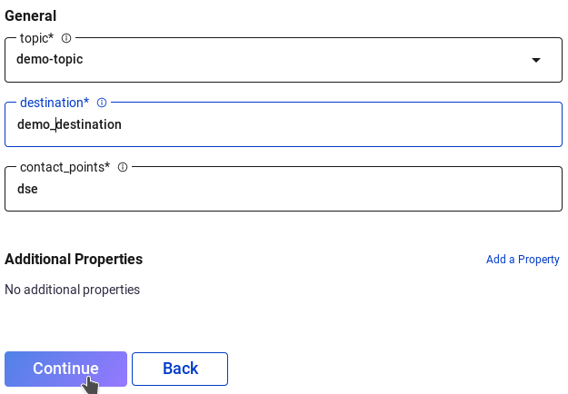
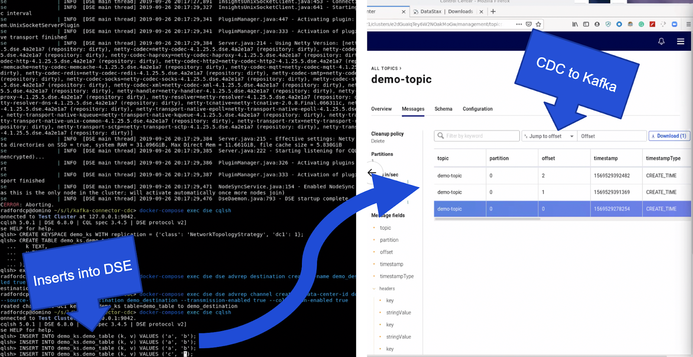

+++ 
draft = false
date = 2019-09-30T15:37:36-04:00
title = "DataStax CDC Connector for Apache Kafka™ Enables Globally Replicated Microservices"
slug = "" 
tags = []
categories = []
thumbnail = "images/tn.png"
description = ""
external_url = "https://www.datastax.com/blog/2019/09/datastax-cdc-connector-apache-kafkatm-enables-globally-replicated-microservices"
+++

Customers -  like Capital One, Delta Airlines, and Macy's - choose [DataStax Enterprise](https://www.datastax.com/products/datastax-enterprise) (DSE) because it's underpinned by [Apache Cassandra](https://www.datastax.com/products/apache-cassandra)™ and thus offers limitless scale and the most battle-tested, geo-replication capabilities on the market. The DataStax Change Data Capture (CDC) Connector for Apache Kafka will empower customers building microservice architectures to provide multi-data center/cloud replication of the Cassandra-backed system of record which will then enable globally synchronized microservices.



To make this possible, we’re introducing a new direction (literally) for our Verified Gold Apache Kafka Connector which is available for preview in [DataStax Labs](https://downloads.datastax.com/#labs). That's right, the connector now functions bidirectionally as both a sink and source for Kafka. Our original connector was the bridge that allowed data to seamlessly move from Kafka to DataStax in event-driven architectures. The latest Labs edition of the connector enables source functionality as deduplicated mutations are forwarded from the CDC system of DataStax.

The previewable connector is designed such that each CDC message is delivered at least once to the DataStax Kafka Connector, and while duplication is possible, it is only likely after failure scenarios. Should there be a loss of connectivity between systems, that link will be reestablished and replication will continue where it previously left off.

Additionally, multiple destinations may be defined, each with its own queue of replication messages. This allows for mutations to be replicated across multiple topics out of the box. Destinations may even be defined for multiple tables where mutations for each may be sent to the same topic.

Given DSE and Kafka are both distributed systems how well does the connector scale? The connector leverages the powerful Kafka Connect framework to distribute tasks across a number of worker nodes and processes. As workload requirements change it is trivial to scale the processes both up and down as required.

## #LetsDoThis

Given the capabilities we've just described, let's fire everything up locally and show you around the new functionality. For the Labs release of the connector we have made it easy to spin up and run both DSE and Kafka with [Docker](https://docs.docker.com/install/) and [Docker Compose](https://docs.docker.com/compose/install/).

* Make sure that Docker and Docker Compose are installed on your system before following the steps below. 

* Download the tarball of the DataStax CDC for Apache Kafka Connector from the DataStax Labs [download page](https://downloads.datastax.com/#labs). 

* Clone the Labs [documentation repo](https://github.com/datastax/labs/tree/master/kafka-connector-cdc).

    ```bash
    git clone https://github.com/datastax/labs.git
    ```

With all of that done, let's get started. In your local checkout of the documentation repository extract the Kafka Connector tarball into the kafka-connector-cdc directory. With that file in place we can start up all of the containers with Docker Compose.

```bash
cd labs/kafka-connector-cdc/ 
mv /some/directory/kafka-connect-dse-2.0.0-20190925-LABS.tar.gz . 
tar xvfz kafka-connect-dse-2.0.0-20190925-LABS.tar.gz
```

Run `docker-compose up -d` in this directory and the following containers will be configured and started:

* ZooKeeper
* Kafka Broker
* Schema Registry
* Kafka Connect
* Control Center
* KSQL Server
* REST Proxy
* DataStax Enterprise

We have bundled a couple of configuration files with the documentation which enable CDC within Cassandra and Advanced Replication within DSE. If you are testing with a DSE cluster outside of the node started with Docker Compose check out the [Advanced Replication documentation](https://docs.datastax.com/en/dse/6.7/dse-dev/datastax_enterprise/advReplication/advRepGetStarted.html#advRepGetStarted__setUpSource) for more information on the steps that have already been taken locally.

With all of the containers up and running it's time to set up the DSE side. First, we create a keyspace and table to hold our data. A CQL Shell can be opened with "docker-compose exec dse cqlsh". If this fails wait another minute for the DSE container to finish starting up. For this demo we are using a simple key/value table with the following schema:

With all of the containers up and running it's time to set up the DSE side. First, we create a keyspace and table to hold our data. A CQL Shell can be opened with `docker-compose exec dse cqlsh`. If this fails wait another minute for the DSE container to finish starting up. For this demo we are using a simple key/value table with the following schema:

```
CREATE KEYSPACE demo_ks WITH replication = {'class': 'NetworkTopologyStrategy', 'dc1': 1};
CREATE TABLE demo_ks.demo_table (
  k TEXT,
  v TEXT,
  PRIMARY KEY ((k))
);
```

Next, we run a pair of commands to configure the DSE Advanced Replication destination and channel. Think of the destination as an endpoint where Kafka connects for messages. A DSE cluster may have multiple destinations on a single cluster. Channels are the glue between tables and destinations. It is possible to configure multiple channels for a single destination which would result in CDC messages for more than one table replicating out to a Kafka cluster. The destination and channel are created with the following commands:

```bash
docker-compose exec dse dse advrep destination create --name demo_destination --transmission-enabled true
docker-compose exec dse dse advrep channel create --data-center-id dc1 --source-keyspace demo_ks --source-table demo_table --destination demo_destination
```

The creation of these resources may be validated with:

```bash
docker-compose exec dse dse advrep destination list
docker-compose exec dse dse advrep channel status
```

That's everything that is required to configure DSE! Now let's move on to configuring Kafka and the connector.

Our Docker Compose file spun up a number of resources for Kafka. Connect to the Control Panel at [http://localhost:9021/](http://localhost:9021/). From here a single cluster should be displayed. Click on this cluster to select it for configuration. 



* **Topic name:** demo-topic
* **Number of partitions:** 1



From here our Kafka topics have been created and we can shift our attention to the connector. In the left sidebar click "Connect" then "connect-default" in the table that's displayed. Next, click the "Add Connector" button and "Connect" under the DseSourceConnector. Enter the following parameters and click "Continue":

* **Name:** demo-connector
* **Tasks max:** 1
* **Key converter class:** JsonConverter
* **Value converter class:** JsonConverter
* **topic:** demo-topic
* **destination:** demo_destination
* **contact_points:** dse




Verify the configuration parameters and click the "Launch" button. With these steps complete head back over to the topic we created earlier to visualize messages as they come in. Back in your terminal open a CQL shell again with "docker-compose exec dse cqlsh" and insert some records into the table we set up.

```
INSERT INTO demo_ks.demo_table (k, v) VALUES ('a', 'b');
INSERT INTO demo_ks.demo_table (k, v) VALUES ('c', 'd');
INSERT INTO demo_ks.demo_table (k, v) VALUES ('e', 'f');
```

Within a few moments the topic interface within the web browser will update indicating the messages that were received. You have now successfully replicated changes from DSE in to Kafka via the DSE Kafka Connector. With this new functionality in hand the world is your oyster.



To learn more: 

* Check out the detailed demo on [GitHub](https://github.com/datastax/labs/tree/master/kafka-connector-cdc)
* Ask questions in the [DataStax Labs Community](https://community.datastax.com/spaces/11/index.html) forum
* Download in [DataStax Labs](http://downloads.datastax.com/#labs)
* Email [techpartner@datastax.com](mailto:techpartner@datastax.com) for anything else
