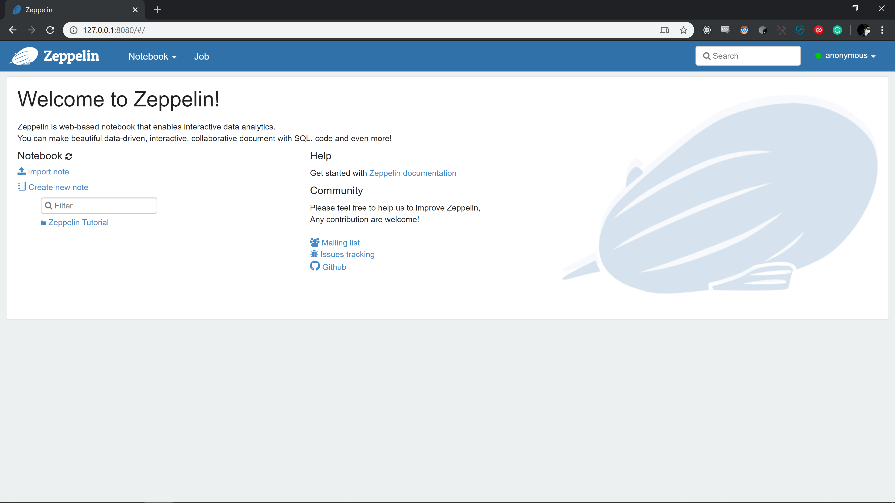
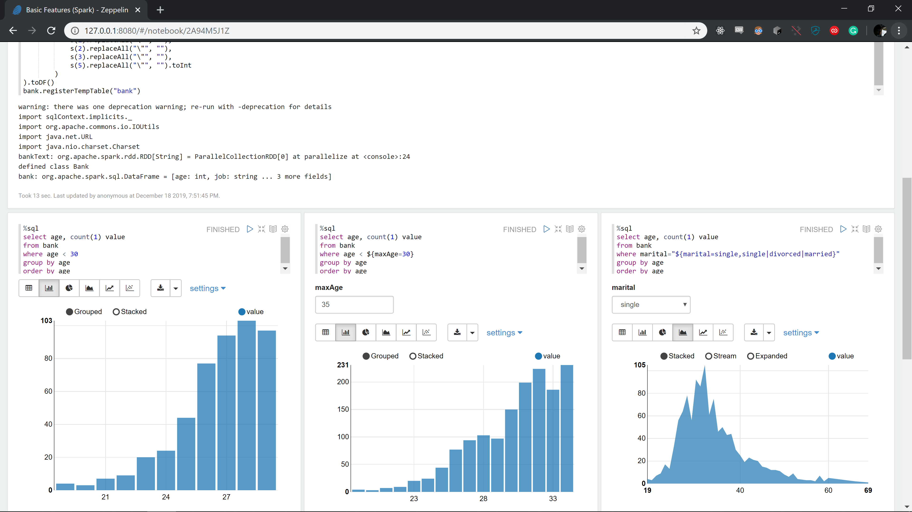
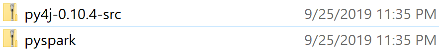
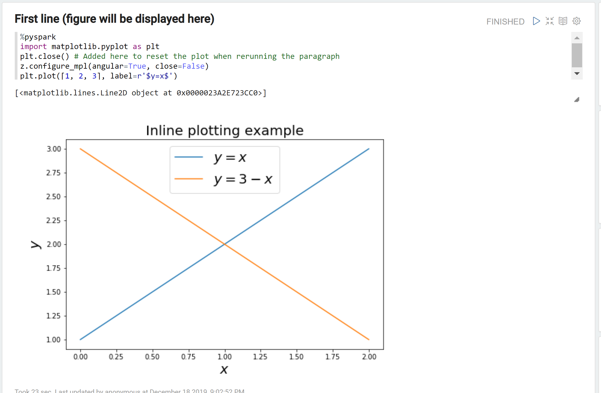

While trying to get Zeppelin up and running locally for a local PySpark project I hit no end of issues. Googling online turned up minimal information related to my supply of error messages. Hopefully this helps you get up and running.

## 0. Prerequisites
To get things started you need a functioning Python environment with PIP available. On my machine I'm using [Anaconda](https://www.anaconda.com/) to install Python 3. The `conda` command _is_ available in PowerShell.

Second Zeppelin is written in Java and requires the JDK to run. Given licensing changes over the past year with Oracle's Java [download and install version 8 of the OpenJDK](https://adoptopenjdk.net/). Make sure to check the box adding it's folders on to your PATH.

Finally after we download zeppelin we will need to extract it from an archive. I'm using [7-zip](https://www.7-zip.org/) as my tool of choice to extract the `.tar.gz` file.

## 1. Download Zeppelin
For my local environment I downloaded the `zeppelin-0.8.2-bin-all.tar.gz` from the [Apache Zeppelin download page].

## 2. "Install" Zeppelin
Zeppelin doesn't have an installer. It is "installed" in whatever directory contains the `zeppelin-0.8.2-bin-all` folder. I've run in to issues in the past with applications having problems
residing in paths containing a " " (space) character. To get around this I'm going to extract the archive in to a directory named `C:\apps\zeppelin-0.8.2`. Fire up PowerShell and run the following:

```
mkdir C:\apps
mkdir C:\apps\zeppelin-0.8.2
```

Now copy the extracted files in to this directory. _Note you may have to extract the file twice as the `.tar.gz` indicates the file is compressed 2x._

```
cp -r ~\Downloads\zeppelin-0.8.2-bin-all\* C:\apps\zeppelin-0.8.2
```

With all the files in place Zeppelin is now "installed". Let's get it started and explore some error messages.

## 3. Running Zeppelin
Open powershell, navigate to the `C:\apps\zeppelin-0.8.2\` directory, and run `bin\zeppelin.cmd`

```
cd C:\apps\zeppelin-0.8.2
.\bin\zeppelin.cmd
```

This is going to start the zeppelin application. Note that some output will be displayed, but it won't be available in your browser until the text `Done, zeppelin server started` is shown. See my output below:

```
PS C:\apps\zeppelin-0.8.2> .\bin\zeppelin.cmd
OpenJDK 64-Bit Server VM warning: ignoring option MaxPermSize=512m; support was removed in 8.0
SLF4J: Class path contains multiple SLF4J bindings.
SLF4J: Found binding in [jar:file:/C:/apps/zeppelin-0.8.2/lib/interpreter/slf4j-log4j12-1.7.10.jar!/org/slf4j/impl/StaticLoggerBinder.class]
SLF4J: Found binding in [jar:file:/C:/apps/zeppelin-0.8.2/lib/slf4j-log4j12-1.7.10.jar!/org/slf4j/impl/StaticLoggerBinder.class]
SLF4J: See http://www.slf4j.org/codes.html#multiple_bindings for an explanation.
SLF4J: Actual binding is of type [org.slf4j.impl.Log4jLoggerFactory]
 WARN [2019-12-18 19:36:28,404] ({main} ZeppelinConfiguration.java[create]:117) - Failed to load configuration, proceeding with a default
 INFO [2019-12-18 19:36:28,419] ({main} ZeppelinConfiguration.java[create]:129) - Server Host: 127.0.0.1
 INFO [2019-12-18 19:36:28,435] ({main} ZeppelinConfiguration.java[create]:131) - Server Port: 8080
 INFO [2019-12-18 19:36:28,435] ({main} ZeppelinConfiguration.java[create]:135) - Context Path: /
 INFO [2019-12-18 19:36:28,466] ({main} ZeppelinConfiguration.java[create]:136) - Zeppelin Version: 0.8.2
 INFO [2019-12-18 19:36:28,482] ({main} Log.java[initialized]:193) - Logging initialized @391ms to org.eclipse.jetty.util.log.Slf4jLog
 WARN [2019-12-18 19:36:28,561] ({main} ServerConnector.java[setSoLingerTime]:458) - Ignoring deprecated socket close linger time
 INFO [2019-12-18 19:36:28,593] ({main} ZeppelinServer.java[setupWebAppContext]:413) - ZeppelinServer Webapp path: C:\apps\zeppelin-0.8.2\webapps
 INFO [2019-12-18 19:36:28,652] ({main} ZeppelinServer.java[main]:239) - Starting zeppelin server
 INFO [2019-12-18 19:36:28,655] ({main} Server.java[doStart]:370) - jetty-9.4.14.v20181114; built: 2018-11-14T21:20:31.478Z; git: c4550056e785fb5665914545889f21dc136ad9e6; jvm 1.8.0_222-b10
 INFO [2019-12-18 19:37:25,514] ({main} StandardDescriptorProcessor.java[visitServlet]:283) - NO JSP Support for /, did not find org.eclipse.jetty.jsp.JettyJspServlet
 INFO [2019-12-18 19:37:25,545] ({main} DefaultSessionIdManager.java[doStart]:365) - DefaultSessionIdManager workerName=node0
 INFO [2019-12-18 19:37:25,545] ({main} DefaultSessionIdManager.java[doStart]:370) - No SessionScavenger set, using defaults
 INFO [2019-12-18 19:37:25,545] ({main} HouseKeeper.java[startScavenging]:149) - node0 Scavenging every 600000ms
 INFO [2019-12-18 19:37:25,764] ({main} SchedulerFactory.java[<init>]:59) - Scheduler Thread Pool Size: 100
 WARN [2019-12-18 19:37:25,780] ({main} ZeppelinConfiguration.java[getConfigFSDir]:527) - zeppelin.config.fs.dir is not specified, fall back to local conf directory zeppelin.conf.dir
 WARN [2019-12-18 19:37:25,780] ({main} ZeppelinConfiguration.java[getConfigFSDir]:527) - zeppelin.config.fs.dir is not specified, fall back to local conf directory zeppelin.conf.dir
DEBUG [2019-12-18 19:37:25,795] ({main} InterpreterSettingManager.java[<init>]:150) - InterpreterRootPath: C:\apps\zeppelin-0.8.2\interpreter
 INFO [2019-12-18 19:37:25,878] ({main} InterpreterSettingManager.java[<init>]:165) - Using RecoveryStorage: org.apache.zeppelin.interpreter.recovery.NullRecoveryStorage
 INFO [2019-12-18 19:37:25,878] ({main} InterpreterSettingManager.java[<init>]:169) - Using LifecycleManager: org.apache.zeppelin.interpreter.lifecycle.NullLifecycleManager
 WARN [2019-12-18 19:37:25,878] ({main} InterpreterSettingManager.java[init]:331) - No interpreter-setting.json found in C:\apps\zeppelin-0.8.2\interpreter\${interpreter.name}
DEBUG [2019-12-18 19:37:25,894] ({main} InterpreterSettingManager.java[registerInterpreterFromPath]:373) - Reading interpreter-setting.json from file C:\apps\zeppelin-0.8.2\interpreter\alluxio\interpreter-setting.json
 INFO [2019-12-18 19:37:26,117] ({main} InterpreterSettingManager.java[registerInterpreterSetting]:425) - Register InterpreterSettingTemplate: alluxio
DEBUG [2019-12-18 19:37:26,117] ({main} InterpreterSettingManager.java[registerInterpreterFromPath]:373) - Reading interpreter-setting.json from file C:\apps\zeppelin-0.8.2\interpreter\angular\interpreter-setting.json
 INFO [2019-12-18 19:37:26,117] ({main} InterpreterSettingManager.java[registerInterpreterSetting]:425) - Register InterpreterSettingTemplate: angular
DEBUG [2019-12-18 19:37:26,132] ({main} InterpreterSettingManager.java[registerInterpreterFromPath]:373) - Reading interpreter-setting.json from file C:\apps\zeppelin-0.8.2\interpreter\bigquery\interpreter-setting.json
 INFO [2019-12-18 19:37:26,132] ({main} InterpreterSettingManager.java[registerInterpreterSetting]:425) - Register InterpreterSettingTemplate: bigquery
DEBUG [2019-12-18 19:37:26,148] ({main} InterpreterSettingManager.java[registerInterpreterFromPath]:373) - Reading interpreter-setting.json from file C:\apps\zeppelin-0.8.2\interpreter\cassandra\interpreter-setting.json
 INFO [2019-12-18 19:37:26,148] ({main} InterpreterSettingManager.java[registerInterpreterSetting]:425) - Register InterpreterSettingTemplate: cassandra
DEBUG [2019-12-18 19:37:26,164] ({main} InterpreterSettingManager.java[registerInterpreterFromPath]:373) - Reading interpreter-setting.json from file C:\apps\zeppelin-0.8.2\interpreter\elasticsearch\interpreter-setting.json
 INFO [2019-12-18 19:37:26,179] ({main} InterpreterSettingManager.java[registerInterpreterSetting]:425) - Register InterpreterSettingTemplate: elasticsearch
DEBUG [2019-12-18 19:37:26,179] ({main} InterpreterSettingManager.java[registerInterpreterFromPath]:373) - Reading interpreter-setting.json from file C:\apps\zeppelin-0.8.2\interpreter\file\interpreter-setting.json
 INFO [2019-12-18 19:37:26,179] ({main} InterpreterSettingManager.java[registerInterpreterSetting]:425) - Register InterpreterSettingTemplate: file
DEBUG [2019-12-18 19:37:26,179] ({main} InterpreterSettingManager.java[registerInterpreterFromPath]:373) - Reading interpreter-setting.json from file C:\apps\zeppelin-0.8.2\interpreter\flink\interpreter-setting.json
 INFO [2019-12-18 19:37:26,179] ({main} InterpreterSettingManager.java[registerInterpreterSetting]:425) - Register InterpreterSettingTemplate: flink
DEBUG [2019-12-18 19:37:26,179] ({main} InterpreterSettingManager.java[registerInterpreterFromPath]:373) - Reading interpreter-setting.json from file C:\apps\zeppelin-0.8.2\interpreter\groovy\interpreter-setting.json
 INFO [2019-12-18 19:37:26,179] ({main} InterpreterSettingManager.java[registerInterpreterSetting]:425) - Register InterpreterSettingTemplate: groovy
DEBUG [2019-12-18 19:37:26,179] ({main} InterpreterSettingManager.java[registerInterpreterFromPath]:373) - Reading interpreter-setting.json from file C:\apps\zeppelin-0.8.2\interpreter\hbase\interpreter-setting.json
 INFO [2019-12-18 19:37:26,179] ({main} InterpreterSettingManager.java[registerInterpreterSetting]:425) - Register InterpreterSettingTemplate: hbase
DEBUG [2019-12-18 19:37:26,179] ({main} InterpreterSettingManager.java[registerInterpreterFromPath]:373) - Reading interpreter-setting.json from file C:\apps\zeppelin-0.8.2\interpreter\ignite\interpreter-setting.json
 INFO [2019-12-18 19:37:26,179] ({main} InterpreterSettingManager.java[registerInterpreterSetting]:425) - Register InterpreterSettingTemplate: ignite
DEBUG [2019-12-18 19:37:26,179] ({main} InterpreterSettingManager.java[registerInterpreterFromPath]:373) - Reading interpreter-setting.json from file C:\apps\zeppelin-0.8.2\interpreter\jdbc\interpreter-setting.json
 INFO [2019-12-18 19:37:26,195] ({main} InterpreterSettingManager.java[registerInterpreterSetting]:425) - Register InterpreterSettingTemplate: jdbc
DEBUG [2019-12-18 19:37:26,195] ({main} InterpreterSettingManager.java[registerInterpreterFromPath]:373) - Reading interpreter-setting.json from file C:\apps\zeppelin-0.8.2\interpreter\kylin\interpreter-setting.json
 INFO [2019-12-18 19:37:26,210] ({main} InterpreterSettingManager.java[registerInterpreterSetting]:425) - Register InterpreterSettingTemplate: kylin
DEBUG [2019-12-18 19:37:26,210] ({main} InterpreterSettingManager.java[registerInterpreterFromPath]:373) - Reading interpreter-setting.json from file C:\apps\zeppelin-0.8.2\interpreter\lens\interpreter-setting.json
 INFO [2019-12-18 19:37:26,210] ({main} InterpreterSettingManager.java[registerInterpreterSetting]:425) - Register InterpreterSettingTemplate: lens
 WARN [2019-12-18 19:37:26,210] ({main} InterpreterSettingManager.java[init]:331) - No interpreter-setting.json found in C:\apps\zeppelin-0.8.2\interpreter\lib
DEBUG [2019-12-18 19:37:26,210] ({main} InterpreterSettingManager.java[registerInterpreterFromPath]:373) - Reading interpreter-setting.json from file C:\apps\zeppelin-0.8.2\interpreter\livy\interpreter-setting.json
 INFO [2019-12-18 19:37:26,210] ({main} InterpreterSettingManager.java[registerInterpreterSetting]:425) - Register InterpreterSettingTemplate: livy
DEBUG [2019-12-18 19:37:26,210] ({main} InterpreterSettingManager.java[registerInterpreterFromPath]:373) - Reading interpreter-setting.json from file C:\apps\zeppelin-0.8.2\interpreter\md\interpreter-setting.json
 INFO [2019-12-18 19:37:26,210] ({main} InterpreterSettingManager.java[registerInterpreterSetting]:425) - Register InterpreterSettingTemplate: md
DEBUG [2019-12-18 19:37:26,226] ({main} InterpreterSettingManager.java[registerInterpreterFromResource]:361) - Reading interpreter-setting.json from jar:file:/C:/apps/zeppelin-0.8.2/interpreter/neo4j/zeppelin-neo4j-0.8.2.jar!/interpreter-setting.json as Resource
 INFO [2019-12-18 19:37:26,226] ({main} InterpreterSettingManager.java[registerInterpreterSetting]:425) - Register InterpreterSettingTemplate: neo4j
DEBUG [2019-12-18 19:37:26,243] ({main} InterpreterSettingManager.java[registerInterpreterFromPath]:373) - Reading interpreter-setting.json from file C:\apps\zeppelin-0.8.2\interpreter\pig\interpreter-setting.json
 INFO [2019-12-18 19:37:26,272] ({main} InterpreterSettingManager.java[registerInterpreterSetting]:425) - Register InterpreterSettingTemplate: pig
DEBUG [2019-12-18 19:37:26,274] ({main} InterpreterSettingManager.java[registerInterpreterFromPath]:373) - Reading interpreter-setting.json from file C:\apps\zeppelin-0.8.2\interpreter\python\interpreter-setting.json
 INFO [2019-12-18 19:37:26,275] ({main} InterpreterSettingManager.java[registerInterpreterSetting]:425) - Register InterpreterSettingTemplate: python
DEBUG [2019-12-18 19:37:26,302] ({main} InterpreterSettingManager.java[registerInterpreterFromPath]:373) - Reading interpreter-setting.json from file C:\apps\zeppelin-0.8.2\interpreter\sap\interpreter-setting.json
 INFO [2019-12-18 19:37:26,318] ({main} InterpreterSettingManager.java[registerInterpreterSetting]:425) - Register InterpreterSettingTemplate: sap
 WARN [2019-12-18 19:37:26,380] ({main} InterpreterSettingManager.java[init]:331) - No interpreter-setting.json found in C:\apps\zeppelin-0.8.2\interpreter\scio
DEBUG [2019-12-18 19:37:26,380] ({main} InterpreterSettingManager.java[registerInterpreterFromPath]:373) - Reading interpreter-setting.json from file C:\apps\zeppelin-0.8.2\interpreter\sh\interpreter-setting.json
 INFO [2019-12-18 19:37:26,380] ({main} InterpreterSettingManager.java[registerInterpreterSetting]:425) - Register InterpreterSettingTemplate: sh
DEBUG [2019-12-18 19:37:26,396] ({main} InterpreterSettingManager.java[registerInterpreterFromPath]:373) - Reading interpreter-setting.json from file C:\apps\zeppelin-0.8.2\interpreter\spark\interpreter-setting.json
 INFO [2019-12-18 19:37:26,396] ({main} InterpreterSettingManager.java[registerInterpreterSetting]:425) - Register InterpreterSettingTemplate: spark
 INFO [2019-12-18 19:37:26,396] ({main} LocalConfigStorage.java[loadInterpreterSettings]:63) - Load Interpreter Setting from file: C:\apps\zeppelin-0.8.2\conf\interpreter.json
 INFO [2019-12-18 19:37:26,427] ({main} InterpreterSettingManager.java[loadFromFile]:279) - Create Interpreter Setting ignite from interpreter.json
 INFO [2019-12-18 19:37:26,427] ({main} InterpreterSettingManager.java[loadFromFile]:279) - Create Interpreter Setting python from interpreter.json
 INFO [2019-12-18 19:37:26,443] ({main} InterpreterSettingManager.java[loadFromFile]:279) - Create Interpreter Setting sap from interpreter.json
 INFO [2019-12-18 19:37:26,458] ({main} InterpreterSettingManager.java[loadFromFile]:279) - Create Interpreter Setting jdbc from interpreter.json
 INFO [2019-12-18 19:37:26,477] ({main} InterpreterSettingManager.java[loadFromFile]:279) - Create Interpreter Setting lens from interpreter.json
 INFO [2019-12-18 19:37:26,478] ({main} InterpreterSettingManager.java[loadFromFile]:279) - Create Interpreter Setting pig from interpreter.json
 INFO [2019-12-18 19:37:26,481] ({main} InterpreterSettingManager.java[loadFromFile]:279) - Create Interpreter Setting flink from interpreter.json
 INFO [2019-12-18 19:37:26,493] ({main} InterpreterSettingManager.java[loadFromFile]:279) - Create Interpreter Setting angular from interpreter.json
 INFO [2019-12-18 19:37:26,509] ({main} InterpreterSettingManager.java[loadFromFile]:279) - Create Interpreter Setting livy from interpreter.json
 INFO [2019-12-18 19:37:26,511] ({main} InterpreterSettingManager.java[loadFromFile]:279) - Create Interpreter Setting file from interpreter.json
 INFO [2019-12-18 19:37:26,524] ({main} InterpreterSettingManager.java[loadFromFile]:279) - Create Interpreter Setting groovy from interpreter.json
 INFO [2019-12-18 19:37:26,540] ({main} InterpreterSettingManager.java[loadFromFile]:279) - Create Interpreter Setting neo4j from interpreter.json
 INFO [2019-12-18 19:37:26,543] ({main} InterpreterSettingManager.java[loadFromFile]:279) - Create Interpreter Setting elasticsearch from interpreter.json
 INFO [2019-12-18 19:37:26,550] ({main} InterpreterSettingManager.java[loadFromFile]:279) - Create Interpreter Setting cassandra from interpreter.json
 INFO [2019-12-18 19:37:26,550] ({main} InterpreterSettingManager.java[loadFromFile]:279) - Create Interpreter Setting sh from interpreter.json
 INFO [2019-12-18 19:37:26,566] ({main} InterpreterSettingManager.java[loadFromFile]:279) - Create Interpreter Setting spark from interpreter.json
 INFO [2019-12-18 19:37:26,566] ({main} InterpreterSettingManager.java[loadFromFile]:279) - Create Interpreter Setting md from interpreter.json
 INFO [2019-12-18 19:37:26,566] ({main} InterpreterSettingManager.java[loadFromFile]:279) - Create Interpreter Setting alluxio from interpreter.json
 INFO [2019-12-18 19:37:26,566] ({main} InterpreterSettingManager.java[loadFromFile]:279) - Create Interpreter Setting bigquery from interpreter.json
 INFO [2019-12-18 19:37:26,566] ({main} InterpreterSettingManager.java[loadFromFile]:279) - Create Interpreter Setting hbase from interpreter.json
 INFO [2019-12-18 19:37:26,566] ({main} InterpreterSettingManager.java[loadFromFile]:279) - Create Interpreter Setting kylin from interpreter.json
 INFO [2019-12-18 19:37:26,598] ({main} LocalConfigStorage.java[save]:53) - Save Interpreter Setting to C:\apps\zeppelin-0.8.2\conf\interpreter.json
 INFO [2019-12-18 19:37:26,717] ({main} VfsLog.java[info]:138) - Using "C:\Users\Trilogy\AppData\Local\Temp\vfs_cache" as temporary files store.
 INFO [2019-12-18 19:37:26,764] ({main} GitNotebookRepo.java[<init>]:64) - Opening a git repo at '/apps/zeppelin-0.8.2/notebook'
 INFO [2019-12-18 19:37:26,950] ({main} NotebookRepoSync.java[<init>]:77) - Instantiate NotebookRepo: org.apache.zeppelin.notebook.repo.GitNotebookRepo
 WARN [2019-12-18 19:37:27,051] ({main} NotebookAuthorization.java[getInstance]:86) - Notebook authorization module was called without initialization, initializing with default configuration
 WARN [2019-12-18 19:37:27,051] ({main} LocalConfigStorage.java[loadNotebookAuthorization]:77) - NotebookAuthorization file C:\apps\zeppelin-0.8.2\conf\notebook-authorization.json is not existed
 INFO [2019-12-18 19:37:27,051] ({main} Credentials.java[loadFromFile]:121) - C:\apps\zeppelin-0.8.2\conf\credentials.json
 INFO [2019-12-18 19:37:27,101] ({main} StdSchedulerFactory.java[instantiate]:1184) - Using default implementation for ThreadExecutor
 INFO [2019-12-18 19:37:27,104] ({main} SimpleThreadPool.java[initialize]:268) - Job execution threads will use class loader of thread: main
 INFO [2019-12-18 19:37:27,115] ({main} SchedulerSignalerImpl.java[<init>]:61) - Initialized Scheduler Signaller of type: class org.quartz.core.SchedulerSignalerImpl
 INFO [2019-12-18 19:37:27,116] ({main} QuartzScheduler.java[<init>]:240) - Quartz Scheduler v.2.2.1 created.
 INFO [2019-12-18 19:37:27,117] ({main} RAMJobStore.java[initialize]:155) - RAMJobStore initialized.
 INFO [2019-12-18 19:37:27,133] ({main} QuartzScheduler.java[initialize]:305) - Scheduler meta-data: Quartz Scheduler (v2.2.1) 'DefaultQuartzScheduler' with instanceId 'NON_CLUSTERED'
  Scheduler class: 'org.quartz.core.QuartzScheduler' - running locally.
  NOT STARTED.
  Currently in standby mode.
  Number of jobs executed: 0
  Using thread pool 'org.quartz.simpl.SimpleThreadPool' - with 10 threads.
  Using job-store 'org.quartz.simpl.RAMJobStore' - which does not support persistence. and is not clustered.

 INFO [2019-12-18 19:37:27,133] ({main} StdSchedulerFactory.java[instantiate]:1339) - Quartz scheduler 'DefaultQuartzScheduler' initialized from default resource file in Quartz package: 'quartz.properties'
 INFO [2019-12-18 19:37:27,149] ({main} StdSchedulerFactory.java[instantiate]:1343) - Quartz scheduler version: 2.2.1
 INFO [2019-12-18 19:37:27,164] ({main} QuartzScheduler.java[start]:575) - Scheduler DefaultQuartzScheduler_$_NON_CLUSTERED started.
 INFO [2019-12-18 19:37:27,251] ({main} FolderView.java[createFolder]:107) - Create folder Zeppelin Tutorial
 INFO [2019-12-18 19:37:27,251] ({main} FolderView.java[createFolder]:107) - Create folder /
 INFO [2019-12-18 19:37:27,251] ({main} Folder.java[setParent]:169) - Set parent of / to /
 INFO [2019-12-18 19:37:27,251] ({main} Folder.java[setParent]:169) - Set parent of Zeppelin Tutorial to /
 INFO [2019-12-18 19:37:27,267] ({main} Folder.java[addNote]:185) - Add note 2C2AUG798 to folder Zeppelin Tutorial
 WARN [2019-12-18 19:37:27,267] ({main} Notebook.java[refreshCron]:981) - execution of the cron job is skipped cron is not enabled from Zeppelin server
 WARN [2019-12-18 19:37:27,267] ({main} InterpreterSettingManager.java[compare]:886) - InterpreterGroup sap is not specified in zeppelin.interpreter.group.order
 WARN [2019-12-18 19:37:27,267] ({main} InterpreterSettingManager.java[compare]:886) - InterpreterGroup sap is not specified in zeppelin.interpreter.group.order
 WARN [2019-12-18 19:37:27,267] ({main} InterpreterSettingManager.java[compare]:892) - InterpreterGroup sap is not specified in zeppelin.interpreter.group.order
 WARN [2019-12-18 19:37:27,267] ({main} InterpreterSettingManager.java[compare]:892) - InterpreterGroup sap is not specified in zeppelin.interpreter.group.order
 WARN [2019-12-18 19:37:27,267] ({main} InterpreterSettingManager.java[compare]:892) - InterpreterGroup sap is not specified in zeppelin.interpreter.group.order
 WARN [2019-12-18 19:37:27,267] ({main} InterpreterSettingManager.java[compare]:892) - InterpreterGroup sap is not specified in zeppelin.interpreter.group.order
 INFO [2019-12-18 19:37:27,267] ({main} Notebook.java[<init>]:127) - Notebook indexing started...
 INFO [2019-12-18 19:37:27,370] ({main} LuceneSearch.java[addIndexDocs]:305) - Indexing 1 notebooks took 90ms
 INFO [2019-12-18 19:37:27,370] ({main} Notebook.java[<init>]:129) - Notebook indexing finished: 1 indexed in 0s
 INFO [2019-12-18 19:37:27,375] ({main} Helium.java[loadConf]:103) - Add helium local registry C:\apps\zeppelin-0.8.2/helium
 INFO [2019-12-18 19:37:27,396] ({main} Helium.java[loadConf]:100) - Add helium online registry https://s3.amazonaws.com/helium-package/helium.json
 WARN [2019-12-18 19:37:27,400] ({main} Helium.java[loadConf]:111) - C:\apps\zeppelin-0.8.2\conf/helium.json does not exists
Dec 18, 2019 7:37:28 PM org.glassfish.jersey.internal.inject.Providers checkProviderRuntime
WARNING: A provider org.apache.zeppelin.rest.ConfigurationsRestApi registered in SERVER runtime does not implement any provider interfaces applicable in the SERVER runtime. Due to constraint configuration problems the provider org.apache.zeppelin.rest.ConfigurationsRestApi will be ignored.
Dec 18, 2019 7:37:28 PM org.glassfish.jersey.internal.inject.Providers checkProviderRuntime
WARNING: A provider org.apache.zeppelin.rest.InterpreterRestApi registered in SERVER runtime does not implement any provider interfaces applicable in the SERVER runtime. Due to constraint configuration problems the provider org.apache.zeppelin.rest.InterpreterRestApi will be ignored.
Dec 18, 2019 7:37:28 PM org.glassfish.jersey.internal.inject.Providers checkProviderRuntime
WARNING: A provider org.apache.zeppelin.rest.NotebookRestApi registered in SERVER runtime does not implement any provider interfaces applicable in the SERVER runtime. Due to constraint configuration problems the provider org.apache.zeppelin.rest.NotebookRestApi will be ignored.
Dec 18, 2019 7:37:28 PM org.glassfish.jersey.internal.inject.Providers checkProviderRuntime
WARNING: A provider org.apache.zeppelin.rest.CredentialRestApi registered in SERVER runtime does not implement any provider interfaces applicable in the SERVER runtime. Due to constraint configuration problems the provider org.apache.zeppelin.rest.CredentialRestApi will be ignored.
Dec 18, 2019 7:37:28 PM org.glassfish.jersey.internal.inject.Providers checkProviderRuntime
WARNING: A provider org.apache.zeppelin.rest.LoginRestApi registered in SERVER runtime does not implement any provider interfaces applicable in the SERVER runtime. Due to constraint configuration problems the provider org.apache.zeppelin.rest.LoginRestApi will be ignored.
Dec 18, 2019 7:37:28 PM org.glassfish.jersey.internal.inject.Providers checkProviderRuntime
WARNING: A provider org.apache.zeppelin.rest.NotebookRepoRestApi registered in SERVER runtime does not implement any provider interfaces applicable in the SERVER runtime. Due to constraint configuration problems the provider org.apache.zeppelin.rest.NotebookRepoRestApi will be ignored.
Dec 18, 2019 7:37:28 PM org.glassfish.jersey.internal.inject.Providers checkProviderRuntime
WARNING: A provider org.apache.zeppelin.rest.HeliumRestApi registered in SERVER runtime does not implement any provider interfaces applicable in the SERVER runtime. Due to constraint configuration problems the provider org.apache.zeppelin.rest.HeliumRestApi will be ignored.
Dec 18, 2019 7:37:28 PM org.glassfish.jersey.internal.inject.Providers checkProviderRuntime
WARNING: A provider org.apache.zeppelin.rest.SecurityRestApi registered in SERVER runtime does not implement any provider interfaces applicable in the SERVER runtime. Due to constraint configuration problems the provider org.apache.zeppelin.rest.SecurityRestApi will be ignored.
Dec 18, 2019 7:37:28 PM org.glassfish.jersey.internal.inject.Providers checkProviderRuntime
WARNING: A provider org.apache.zeppelin.rest.ZeppelinRestApi registered in SERVER runtime does not implement any provider interfaces applicable in the SERVER runtime. Due to constraint configuration problems the provider org.apache.zeppelin.rest.ZeppelinRestApi will be ignored.
Dec 18, 2019 7:37:28 PM org.glassfish.jersey.internal.Errors logErrors
WARNING: The following warnings have been detected: WARNING: A HTTP GET method, public javax.ws.rs.core.Response org.apache.zeppelin.rest.InterpreterRestApi.listInterpreter(java.lang.String), should not consume any entity.
WARNING: A HTTP GET method, public javax.ws.rs.core.Response org.apache.zeppelin.rest.CredentialRestApi.getCredentials(java.lang.String) throws java.io.IOException,java.lang.IllegalArgumentException, should not consume any entity.
WARNING: The (sub)resource method createNote in org.apache.zeppelin.rest.NotebookRestApi contains empty path annotation.
WARNING: The (sub)resource method getNoteList in org.apache.zeppelin.rest.NotebookRestApi contains empty path annotation.

Dec 18, 2019 7:37:28 PM org.glassfish.jersey.internal.Errors logErrors
WARNING: The following warnings have been detected: WARNING: A HTTP GET method, public javax.ws.rs.core.Response org.apache.zeppelin.rest.CredentialRestApi.getCredentials(java.lang.String) throws java.io.IOException,java.lang.IllegalArgumentException, should not consume any entity.
WARNING: A HTTP GET method, public javax.ws.rs.core.Response org.apache.zeppelin.rest.InterpreterRestApi.listInterpreter(java.lang.String), should not consume any entity.
WARNING: The (sub)resource method createNote in org.apache.zeppelin.rest.NotebookRestApi contains empty path annotation.
WARNING: The (sub)resource method getNoteList in org.apache.zeppelin.rest.NotebookRestApi contains empty path annotation.

 INFO [2019-12-18 19:37:28,493] ({main} ContextHandler.java[doStart]:855) - Started o.e.j.w.WebAppContext@2b546384{zeppelin-web,/,file:///C:/apps/zeppelin-0.8.2/webapps/webapp/,AVAILABLE}{C:\apps\zeppelin-0.8.2\zeppelin-web-0.8.2.war}
 INFO [2019-12-18 19:37:28,524] ({main} AbstractConnector.java[doStart]:292) - Started ServerConnector@2849434b{HTTP/1.1,[http/1.1]}{127.0.0.1:8080}
 INFO [2019-12-18 19:37:28,524] ({main} Server.java[doStart]:407) - Started @60427ms
 INFO [2019-12-18 19:37:28,524] ({main} ZeppelinServer.java[main]:249) - Done, zeppelin server started
```

With Zeppelin started we can now navigate to the web interface and verify it is behaving as we expect. Open [http://127.0.0.1:8080/#/](http://127.0.0.1:8080/#/) in your browser and let the user interface load.



## Testing Zeppelin

Now that we are in the web interface let's kick the tires and see if it _just works_. Zeppelin ships with a number of tutorial notebooks. In the left-most column select the `Zeppelin Tutorial` entry in the list (it has a little folder icon next to it) then choose the `Basic Features (Spark)` notebook. Next click the "Play" icon in the top toolbar and confirm the operation. This will execute all paragraphs in the notebook using a background process.

As it runs you will see some output beneath each paragraph. The second paragraph reads in a CSV file in to a dataframe and registers it for querying with Spark SQL. The following three paragraphs run SQL queries against this table and graph the results.



With a regular Spark notebook running without any issues let's try some Python and PySpark. Back at the top of the window select the `Notebook` entry in the main navigation bar. Select `Zeppelin Tutorial` again then choose `Matplotlib (Python - PySpark)`. _You may be asked to configure your interpreters. Simply click the `Save` button if it appears._ Just like last time let's play button to run all paragraphs again.

We are quickly alerted to an issue when the second paragraph is attempted to run. The error message presented:

```
org.apache.thrift.TApplicationException: Internal error processing createInterpreter
	at org.apache.thrift.TApplicationException.read(TApplicationException.java:111)
	at org.apache.thrift.TServiceClient.receiveBase(TServiceClient.java:71)
	at org.apache.zeppelin.interpreter.thrift.RemoteInterpreterService$Client.recv_createInterpreter(RemoteInterpreterService.java:209)
	at org.apache.zeppelin.interpreter.thrift.RemoteInterpreterService$Client.createInterpreter(RemoteInterpreterService.java:192)
	at org.apache.zeppelin.interpreter.remote.RemoteInterpreter$2.call(RemoteInterpreter.java:169)
	at org.apache.zeppelin.interpreter.remote.RemoteInterpreter$2.call(RemoteInterpreter.java:165)
	at org.apache.zeppelin.interpreter.remote.RemoteInterpreterProcess.callRemoteFunction(RemoteInterpreterProcess.java:135)
	at org.apache.zeppelin.interpreter.remote.RemoteInterpreter.internal_create(RemoteInterpreter.java:165)
	at org.apache.zeppelin.interpreter.remote.RemoteInterpreter.open(RemoteInterpreter.java:132)
	at org.apache.zeppelin.interpreter.remote.RemoteInterpreter.getFormType(RemoteInterpreter.java:299)
	at org.apache.zeppelin.notebook.Paragraph.jobRun(Paragraph.java:408)
	at org.apache.zeppelin.scheduler.Job.run(Job.java:188)
	at org.apache.zeppelin.scheduler.RemoteScheduler$JobRunner.run(RemoteScheduler.java:315)
	at java.util.concurrent.Executors$RunnableAdapter.call(Executors.java:511)
	at java.util.concurrent.FutureTask.run(FutureTask.java:266)
	at java.util.concurrent.ScheduledThreadPoolExecutor$ScheduledFutureTask.access$201(ScheduledThreadPoolExecutor.java:180)
	at java.util.concurrent.ScheduledThreadPoolExecutor$ScheduledFutureTask.run(ScheduledThreadPoolExecutor.java:293)
	at java.util.concurrent.ThreadPoolExecutor.runWorker(ThreadPoolExecutor.java:1149)
	at java.util.concurrent.ThreadPoolExecutor$Worker.run(ThreadPoolExecutor.java:624)
	at java.lang.Thread.run(Thread.java:748)
```

is a bit misleading. The error message is saying there was an issue creating the interpreter where the paragraph is actually executed. In our PowerShell window the true error is displayed:

```
DEBUG [2019-12-18 19:57:56,112] ({Exec Stream Pumper} RemoteInterpreterManagedProcess.java[processLine]:298) - Caused by: java.lang.RuntimeException: java.io.IOException: The system cannot find the path specified
DEBUG [2019-12-18 19:57:56,112] ({Exec Stream Pumper} RemoteInterpreterManagedProcess.java[processLine]:298) -  at org.apache.zeppelin.python.PythonInterpreter.<init>(PythonInterpreter.java:105)
DEBUG [2019-12-18 19:57:56,112] ({Exec Stream Pumper} RemoteInterpreterManagedProcess.java[processLine]:298) -  ... 13 more
DEBUG [2019-12-18 19:57:56,112] ({Exec Stream Pumper} RemoteInterpreterManagedProcess.java[processLine]:298) - Caused by: java.io.IOException: The system cannot find the path specified
DEBUG [2019-12-18 19:57:56,112] ({Exec Stream Pumper} RemoteInterpreterManagedProcess.java[processLine]:298) -  at java.io.WinNTFileSystem.createFileExclusively(Native Method)
DEBUG [2019-12-18 19:57:56,112] ({Exec Stream Pumper} RemoteInterpreterManagedProcess.java[processLine]:298) -  at java.io.File.createTempFile(File.java:2024)
DEBUG [2019-12-18 19:57:56,112] ({Exec Stream Pumper} RemoteInterpreterManagedProcess.java[processLine]:298) -  at org.apache.zeppelin.python.PythonInterpreter.<init>(PythonInterpreter.java:102)
DEBUG [2019-12-18 19:57:56,112] ({Exec Stream Pumper} RemoteInterpreterManagedProcess.java[processLine]:298) -  ... 13 more
```

Googling around for `java.io.IOException: The system cannot find the path specified` wasn't very productive so our next step was to take a look at the code. Github hosts a mirror of the project's repository at [apache/zeppelin](https://github.com/apache/zeppelin). Select the `Branches` drop down on th left and select the `Tags` tab. Here enter the version we're running `0.8.2` or select it from the list. This will take you to [https://github.com/apache/zeppelin/tree/v0.8.2](https://github.com/apache/zeppelin/tree/v0.8.2) which _should_ represent the code used to build the version we have installed.

![github_tags.png]

Now we press the `t` key which brings up a search box that filters file names. Enter `PythonInterpreter.java` which is listed in our error message output and press `Enter`. Now we will scroll down to line `105` and take a look at the code:

```java
  public PythonInterpreter(Properties property) {
    super(property);
    try {
      File scriptFile = File.createTempFile("zeppelin_python-", ".py", new File("/tmp"));
      scriptPath = scriptFile.getAbsolutePath();
    } catch (IOException e) {
      throw new RuntimeException(e);
    }
  }
```

The error message is being caused by an attempt to create a file under `/tmp`. Looking at our harddrive there is no `/tmp` directory. Let's make that and see what happens.

```
mkdir /tmp
```

Clicking the play button on the second paragraph resulted in a graph being displayed! Excellent, let's try it again with the entire notebook.

```
Traceback (most recent call last):
  File "C:\Users\Trilogy\AppData\Local\Temp\zeppelin_pyspark-5585656243242624288.py", line 22, in <module>
    from pyspark.conf import SparkConf
ModuleNotFoundError: No module named 'pyspark'
Traceback (most recent call last):
  File "C:\Users\Trilogy\AppData\Local\Temp\zeppelin_pyspark-5585656243242624288.py", line 22, in <module>
    from pyspark.conf import SparkConf
ModuleNotFoundError: No module named 'pyspark'
pyspark is not responding
```

Drat, it looks like we don't have PySpark installed. Let's take care of this with:

```
pip install pyspark
```

Running the paragraph returned the text `pyspark is not returning`. Given we just changed a library let's stop Zeppelin and start it back up. After the process restarts run the notebook again. Now we are met with a new error:

```
import org.apache.spark.SparkContext._
import spark.implicits._
import spark.sql
import org.apache.spark.sql.functions._
Traceback (most recent call last):
  File "C:\Users\Trilogy\AppData\Local\Temp\zeppelin_pyspark-6390702313557505597.py", line 309, in <module>
    sc = _zsc_ = SparkContext(jsc=jsc, gateway=gateway, conf=conf)
  File "C:\Users\Trilogy\Anaconda3\lib\site-packages\pyspark\context.py", line 119, in __init__
    if gateway is not None and gateway.gateway_parameters.auth_token is None:
AttributeError: 'GatewayParameters' object has no attribute 'auth_token'
```

This looks like we're trying to call code that doesn't exist. Poking around in the source code for this library indicates that this method should have the `auth_token` parameter. Digging around in the `C:\apps\zeppelin-0.8.2\interpreter\spark\pyspark` directory there are two zip files present.



Looking at the version of `py4j` installed along with PySpark my versions don't match! Let's see if we can figure out the version of PySpark in use here (along with Py4J). Py4J makes it easy for us by including the version in the filename `0.10.4` (vs `0.10.7` that was installed with our `pip install` invocation). PySpark is a little trickier as the version is not included in the filename of the archive. Let's extract this archive and take a look at the `version.py` file in the extracted folder. This indicates Zeppelin 0.8.2 wants to use `pyspark==2.2.1`. At this point we can delete our extracted folder and invalid version then install the appropriate version.

```
rm C:\apps\zeppelin-0.8.2\interpreter\spark\pyspark\pyspark
pip uninstall pyspark py4j
pip install pyspark==2.2.1 py4j==0.10.4
```

With these changes in place go ahead and fire Zeppelin back up. Running all the paragraphs should complete without any issues.



You now have a fully functioning Zeppelin installation with connected Python and PySpark interpretters.

## TL;DR

```
mkdir /tmp
pip install pyspark==2.2.1 py4j==0.10.4
```
