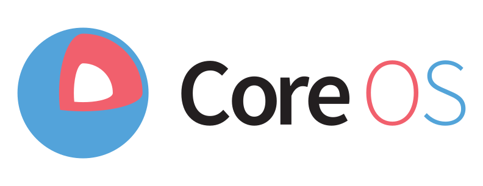

+++ 
draft = false
date = 2016-04-11T16:48:24-04:00
title = "Shipping Containers - effectively deploying containers in the cloud. "
slug = "" 
tags = []
categories = []
thumbnail = "images/tn.png"
description = ""
external_url = "https://opensourceconnections.com/blog/2016/04/11/shipping-containers-effectively-deploying-containers-in-the-cloud/"
+++

_This is part 2 of a 3 part series on our move to containers as a platform for Quepid. Be sure to check out Part 1 on generating deployable containers. Part 3 will be linked here once it has been published._

In our last installment we discussed wrapping an application and **all** of its dependencies in a single easily deployed container. Running the container locally is trivial, but how can this be deployed into a hosting environment? Our deployment exploration has now shifted to getting the artifacts shipped!

[CoreOS](https://coreos.com/), a linux distribution, was first up for testing. This distribution is designed from the ground up to run containers. We briefly mentioned the [coreos-vagrant](https://github.com/coreos/coreos-vagrant) project for running containers locally in a virtual machine. It has very clear [documentation](https://coreos.com/releases/) around release versions and channels. It is trivial to test out new versions of the OS and receive updates across production, beta and alpha releases. CoreOS ships with some additional technologies for scheduling and coordinating clusters of servers. Instead of managing servers individually CoreOS pushes the concept of running a cluster of resources. From here a scheduler may assign containers evenly across the available resources. This leads to better resource utilization and a reduction in the number of required hosts.

CoreOS provides Fleet, a scheduling system built atop SystemD’s unit files. To deploy a container we generate a SystemD unit file and push it to the cluster. This file describes resource requirements and conditions. A sample requirement being that another container must also be present on this host, or a condition mentioning any service conflicts. Fleet then chooses a system on the cluster to execute the unit. All interactions with the cluster are through the `fleetctl` command line tool.

Another entry in the CoreOS toolbox is [Etcd](https://coreos.com/etcd/), a distributed key-value store. Etcd allows for reading and writing of values as well as watching keys or their directories. Within CoreOS, node restarts are coordinated by holding an election within etcd among all nodes that need to restart. Applications may store their configuration in etcd. This allows changes to be made to the running configuration with change events pushed to the application.

We spun up a CoreOS cluster and took it for a spin. The first container deployed housed Elasticsearch. We crafted a unit file for fleet that describes the commands to start and stop our container. This file is then submitted to the cluster with `fleetctl load`. The fleet service handles finding a machine and running the job. Within our unit file we may specify a `Conflicts` section which indicates that it should not be run on a node already running this unit (in our case we want to avoid port collision). As part of this configuration it was necessary to design side-car processes. These would run alongside other units in the cluster and register their name and address within etcd. For instance if another service in our cluster depends on Elasticsearch it could query etcd for the address.

Around this time a lookup meetup group [DevOpsCV](http://www.meetup.com/DevOpsCV/) hosted a meeting with Brian Akins of CoreOS giving an overview of Docker and CoreOS. While there we were introduced to Kubernetes, also known as k8s, another open source scheduling system. Kubernetes started as an open source project at Google. It was designed as an automated system for running containers at massive scale. This year’s [GCP NEXT](https://cloudplatformonline.com/NEXT2016.html) conference dove into some of the history of Kubernetes and the experiences Google pulled from it’s predecessor [Borg](http://research.google.com/pubs/pub43438.html). To get started with Kubernetes we took a look at another Vagrant powered project from CoreOS, [coreos-kubernetes](https://github.com/coreos/coreos-kubernetes). This allowed us to experiment with a local K8S cluster.

Kubernetes provides a few basic building blocks to orchestrate applications. A **Pod** represents a collection of containers that should be run together. Why would we run multiple containers together? Within Quepid we run an Elasticsearch service listening for searches against a couple of sample datasets. This service is composed of three distinct components each wrapped in a container. The first container runs the Elasticsearch process. Since this service is exposed to the internet let’s place some access control in front of it. Our second container runs Nginx as a reverse proxy to the first with a set of security rules. Finally our third container runs a process which pulls a JSON backup of the sample dataset and streams it into the Elasticsearch service. This combination of containers together makes up a distinct unit of functionality within our stack and gets scheduled as such in a pod.

Now that we have a pod let’s talk about scheduling it on the cluster. We can take the pod definition, a YAML file, and deploy it with the `kubectl` command line tool. This will fire up the defined containers together on a node in the cluster and make them available at an internal cluster IP. It is now possible to talk with the running Elasticsearch service! Unfortunately servers don’t stay up forever, hardware fails. When this happens the pod is gone and our customer’s are left without an Elasticsearch service to query. Fortunately Kubernetes has another building block available, the **Replication Controller**, to handle this. Replication controllers automate the process of scheduling pods on the cluster. In another YAML file we define the number of instances of the pod along with the pod definition. This gets pushed to the cluster via `kubectl` just like the pod YAML. Now Kubernetes handles scheduling our pods. When a node goes down the cluster automatically spins-up replacement pods. It’s also worth noting that scaling the number of application instances up is trivial. We update the replication controller YAML file and push the change out. It immediately schedules a new pod.

At this point we have a highly available Elasticsearch resource, but if we want to talk to it we need the pod’s IP address AND knowledge of how to setup a route to the cluster! Kubernetes is ready for us again with the **Service** component. Services route traffic both within the cluster and from outside services to the appropriate nodes & pods. When we define the replication controller certain metadata may be included within the pod template. In our example we label any pods created with the key “application” and value “sample-elasticsearch”. Next the service is generated with a **selector** that looks for the same label key-value pair. Any traffic directed at the service will automatically be forwarded along to an appropriate pod. It also generates a DNS entry **within** the cluster pointing at the service. Externally all nodes on the cluster start listening on a common port. Any traffic to that port is then forwarded to the internal service. This handles routing in a highly available environment where the Pod IP address isn’t necessarily known given we are no longer doing the scheduling.

It is common to have a few environments where an application runs. For example I may use a “staging” environment as a place to test code before pushing to the “production” environment. In our initial build out on Kubernetes all pods had an “environment” label which the services used to direct traffic appropriately. Each of the replication controllers and services had the environment name as part of their names. `prod-es-svc` or `prod-es-rc` were common. We ended up running into name length restrictions so we started abbreviating. This worked, but felt a bit clunky. After speaking with a Google engineer we were directed to **Namespaces**. Namespaces allow us to logically group resources together in an isolated manner. We use namespaces to group our environments.

With these powerful components we started assembling our stack. Application components were assembled and services deployed. Everything was going well until pods stopped launching. A quick look at `kubectl get po` revealed that all new pods were being scheduled, but there state was pending. What made this interesting was when we deleted a pod one of the pending pods would start up. Digging a little deeper revealed resource limits! By default every container is assigned a number of CPU and RAM resources. Each server has a finite amount of resources available based on CPU core count and memory capacity. By not setting any limits Kubernetes used the defaults. We took another pass through our definitions assigning appropriate values. For instance the data loader on our pod doesn’t need the same amount of CPU as the actual Elasticsearch process. After adjusting these values more pods came online, but not all of them. Even with the adjusted values we were still short on resources. Our next move was to resize the cluster. After bringing a new node online Kubernetes started scheduling pods on the new hardware. Today resource utilization is balanced across all nodes in the cluster.

Resizing the cluster is still an operational task. You have to spin-up the new node and join it to the cluster. There is also a Kubernetes master that must be running somewhere. This in turn communicates with a etcd cluster which in turn should probably be running on multiple nodes for HA purposes. Instead of setting up and configuring a cluster we decided to use the hosted Google Container Engine (GKE) product of the Google Cloud Platform (GCP). This product provides a fully managed Kubernetes Master node and etcd cluster. Our nodes are placed within a Google Compute Instance Group. All instances in this group are templated with the same configuration. Increasing the number of nodes in our cluster is a simple change to the number of instances in the group. They have also integrated with some of the products within GCP to utilize built in components like load balancers.

We investigated some other closed-source solutions for running containers. Amazon provides two solutions for running container based applications. [Elastic Beanstalk](https://aws.amazon.com/elasticbeanstalk/) was the first to support running Docker containers. EB abstracts away infrastructure away making deploying on the cloud simple. It supports some awesome features like environment cloning and automated scaling. Next is the more recent [EC2 Container Service](https://aws.amazon.com/ecs/). This option has Amazon managing the EC2 instances and other AWS resources to operate your application. These are both very capable options, but we wanted to avoid lock-in with a particular vendor. While we are using hosted GKE, a product of a particular vendor we can easily move to another provider if needed. All of the component definitions will work regardless of where K8S is running.

With Kubernetes being our platform of choice we created some tooling around it. First we updated our CI pipeline to automatically build containers and test their functionality prior to pushing to a repository. Next we focused on our Rails application. We developed a suite of rake tasks for interacting with the cluster. Our first task handles version number updates in the replication controllers. Once they are updated it performs a rolling restart of the application. If for some reason the new application doesn’t come up engineers are notified to fix the problem before it impacts customers. We need log output to help with troubleshooting. GCP provides a web interface to drill-down in to container logs, but a quick rake task to tail them in our terminal was a welcome feature. Finally we have tasks for scaling up and down the number of pods on our cluster. Should we need additional capacity we’re just a quick command away.

Our Quepid stack is running and available to customers. All services are highly available with automated systems to scale and deploy. Operations tasks are trivial with either a web-interface or simple CLI tools to handle most tasks. With Kubernetes powering our infrastructure we have a rock solid platform for hosting our application. Join us in the final installment where we dive in to Grand Central, our tool for on-demand QA & feature environments with no need to deploy! We explore its setup, use, and internals. If you’re interested in exploring containers in your infrastructure say hi! We’ll be happy to explore your use case with our team of operations experts.
